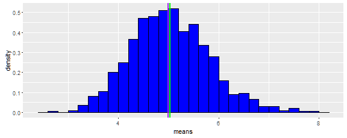
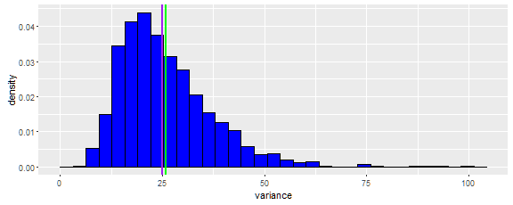
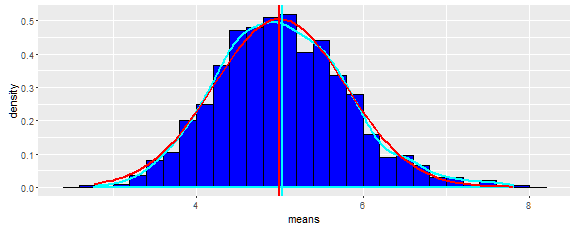
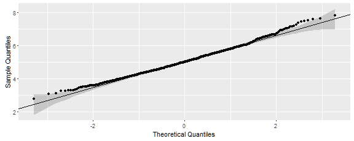
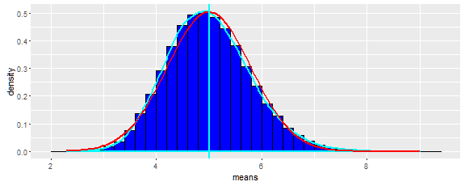
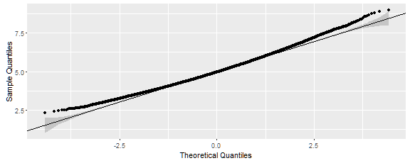

# Essay on the Exponential Distribution


## Overview

In this project we will study the exponential distribution. This distribution is characterised by single parameter
$\lambda$. We will simulate the exponential distribution in **R** and compare it with
the Central Limit Theorem.
Exponential distribution has mean equal to 1/$\lambda$,
and the standard deviation is 1/$\lambda$ as well.
$\lambda$ = 0.2 will be used throughout the simulation.
We will investigate the distribution of averages of 40 exponentials, and
distribution size would be equal to a thousand simulations.


## Simulation

We set parameters and sample 1000 cases wih 40 exponentials each. We store results into a
matrix and then compute mean and variance for those exponentials.


```r
set.seed(223456L) # to ensure reproducability
```


```r
n        <- 40L  # number of exponentials
lambda   <- 0.2  # exponential parameter - rate
nof_sims <- 1000L # number of simulations

# distribution of sims as a matrix
exp.dist <- matrix(data = rexp(n * nof_sims, lambda), nrow = nof_sims)
exp.smpl <- data.table(means = apply(exp.dist, 1, mean), variance = apply(exp.dist, 1, var))
```


We simulated the all cases of 40 exponentials, and computed mean and put it in the data table of the length
1000. We have 2 observables in the data table - sampled mean and sampled variance.

## Sample Mean versus Theoretical Mean

Theoretical mean of the exponential distribution $\mu$ is inverse of
the $\lambda$ and could be easily computed.

$\mu= \frac{1}{\lambda}$


In our case the theoretical mean value is equal to 5. Lets compare it to the sampled mean value *m*.


```r
m <- round(mean(exp.smpl$means), 3)
```

The sample mean value is equal to 5.038. One can see that the expected mean and sampled mean are very close. We plot the mean histogram alongside with the theoretical mean (purple line)
and sampled mean (green line).

 

## Sample Variance versus Theoretical Variance

Theoretical standard deviation of the exponential distribution $\sigma$ is
also inverse of the $\lambda$, and distribution variance as well is expressed via
$\lambda$.

$\sigma = \frac{1}{\lambda}$

$Var = \sigma^2 = \frac{1}{\lambda^2}$


Theoretical variance is equal to 25. Lets compute sample variance as mean
value of the variance column in our data.table.


```r
s2 <- round(mean(exp.smpl$variance), 3)
```

Comparing theoretical variance of  25 to sampled variance 25.957, one
can see they are very close. We plot variance distribution together with
theoretical (purple) and sampled (green) variance

 

Another way to look at variance comparison is to compute variance of the
sample versus distribution sample variance.
Theoretical one for a given sample size *n* is equal to distribution
variance divided by *n*.  Variance of the sample
could be computed applying *var()* function to the sampled vector of means.

$Var_n = \frac{\sigma^2}{n}$


```r
v2 <- round(var(exp.smpl$means), 3)
vn <- sigma2/n
```

Value we got are 0.61 for theoretical and 0.625 for sampled, and one can
see they are very close to each other.

## Distribution

For inspection and comparison we plot means distribution together with
overlapping theoretical gaussian curve (red) as well as smooth sample distribution curve (cyan).
From visual inspection those curves are very close to each other.

 


We provide Quantile-Quantile Plot for determining if two data sets come
from populations with a common distribution. One curve is a linear
one computed from theoretical distribution. Another one is computed from
sampled means distribution. We could see that points from sample fall appproximately
along the theoretical reference line.

 

```
##       25%       75% 
## 5.0211512 0.7862921
```

## Appendix A

Markdown code is available from the **GitHub** repository at *https://github.com/Oleg-Krivosheev/Statistical-Inference-Course-Project/one.Rmd*

Q-Q plots are described in detail at *http://www.itl.nist.gov/div898/handbook/eda/section3/qqplot.htm*.

Code for **ggplot2** Q-Q plot was taken from *http://stackoverflow.com/a/27191036/4044696*
and modified by the author.

## Appendix B

We recompute and replot distributions here doing fine sampling with 100,000 samples instead
of original 1,000 ones. As one can see, the result is even more conforming to the
gaussian distribution.


```r
set.seed(123456L) # to ensure reproducability
```


```r
nof_sims <- 100000L # number of simulations

exp.dist <- matrix(data = rexp(n * nof_sims, lambda), nrow = nof_sims)
exp.smpl <- data.table(means = apply(exp.dist, 1, mean), variance = apply(exp.dist, 1, var))

m <- round(mean(exp.smpl$means), 3)
```

Dsitrbution plot, using same conventions as before.

 

Mean values are prety much indistibguishable  from each other.

Q-Q plot, again, same conventions are used.

 

```
##       25%       75% 
## 4.9762565 0.7860994
```
