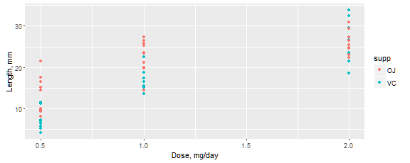
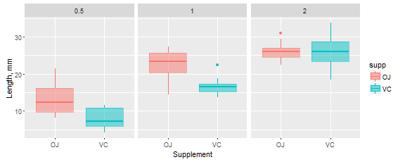

# The Effect of Vitamin C on Tooth Growth in Guinea Pigs


## Overview

We will analyze the effect of Vitamin C on Tooth Growth in Guinea Pigs (a.k.a cavies).
Data are located in the **R** datasets package. We will use hypothesis testing
to compare tooth growth by supplement and dose.


## Data

The response is the length of odontoblasts (cells responsible for tooth growth) in 60 guinea pigs.
Each animal received one of three dose levels of vitamin C (0.5, 1, and 2 mg/day) by one of two
delivery methods, orange juice (OJ) or ascorbic acid (a form of vitamin C, coded as VC).


```r
tg <- as.data.table(ToothGrowth) # data loaded as data.table
```

## Exploratory Data Analysis


```
## Classes 'data.table' and 'data.frame':	60 obs. of  3 variables:
##  $ len : num  4.2 11.5 7.3 5.8 6.4 10 11.2 11.2 5.2 7 ...
##  $ supp: Factor w/ 2 levels "OJ","VC": 2 2 2 2 2 2 2 2 2 2 ...
##  $ dose: num  0.5 0.5 0.5 0.5 0.5 0.5 0.5 0.5 0.5 0.5 ...
##  - attr(*, ".internal.selfref")=<externalptr> 
## NULL
```

We have 60 observables of the three variables in the data table.


```
##       len        supp         dose      
##  Min.   : 4.20   OJ:30   Min.   :0.500  
##  1st Qu.:13.07   VC:30   1st Qu.:0.500  
##  Median :19.25           Median :1.000  
##  Mean   :18.81           Mean   :1.167  
##  3rd Qu.:25.27           3rd Qu.:2.000  
##  Max.   :33.90           Max.   :2.000
```

We have two numeric columns and one factor column (OJ/VC). Teeth length
varies  wildly from 4.2 to 33.9 mm.

From the we could check how man pigs were tested for each dose level and supplement.

```
##     
##      0.5  1  2
##   OJ  10 10 10
##   VC  10 10 10
```

We plot length versus dose, for a different supplement marked by color. We would state that
both dosage and supplement affect teeth growth. How much we will explore in our Hypothesis testing
section.

 

Next, we explore mean teeth length values grouped by supplement and dose, as well as std.deviation.
Judging by the table, it is reasonable to guess that dose and supplement might be a significat effect
given our confidence level.


```
##    dose supp mean_len  std.dev
## 1:  0.5   VC     7.98 2.746634
## 2:  1.0   VC    16.77 2.515309
## 3:  2.0   VC    26.14 4.797731
## 4:  0.5   OJ    13.23 4.459709
## 5:  1.0   OJ    22.70 3.910953
## 6:  2.0   OJ    26.06 2.655058
```
Plot of the data grouped by dose and supplement, please refer to Appendix B.

## Hypothesis Testing

Our null hypothesis is that the mean tooth growth for
the orange juice (OJ) group is equal to the mean tooth growth of the
ascorbic acid (VC) group, for the same dosage of vitamin C.

$H_0: \mu_{OJ} - \mu_{VC} == 0$

The alternative hypothesis is that they are not equal.

$H_a: \mu_{OJ} - \mu_{VC} > 0$

Because we established that only 10 pigs are a subjects of each experiment,
we will use t-test to find p-value and either accept or reject null-hypothesis.

We assume $\alpha=0.05$, which corresponds to a 95% confidence interval.

We split our data table into three ones by the dose value.


For a given dose value, we run t-test assuming that subjects are not paired and
variances are NOT equal. Such test will produce wider confidence interval which
facilitate the hypothesis testing.

### Dose Value 0.5 mg/day

```
## p-value = 0.006
```

```
## 95 percent confidence interval: 1.719 8.781
```
P-value is very small, only about 0.006 which allow us safely reject null hypothesis
using this most permissive test. Confidence interval is clearly above zero,
which favors alternative hypothesis.

### Dose Value 1.0 mg/day

```
## p-value = 0.001
```

```
## 95 percent confidence interval: 2.802 9.058
```
P-value is very small as well, about 0.001, which allow us reject null hypothesis.
Confidence interval is clearly above zero, which favors alternative hypothesis.

### Dose Value 2.0 mg/day

```
## p-value = 0.964
```

```
## 95 percent confidence interval: -3.798 3.638
```
Here p-value is very large, equal to 0.964, confidence interval is large as well,
almost symmetric and clearly contains 0. Here we fail to reject null hypothesis.

Lets try for dose 2.0 mg/day t-test assuming that data are paired and variance is equal.
Sort data first and then apply t-test with paired equal to true, and var.equal set to true as well.
That procedure will produce smallest p-value and smallest confidence interval, which might allow us
to reject null hypothesis.

```
## p-value = 0.911
```

```
## 95 percent confidence interval: -1.658 1.498
```
As one can see, confidence interval gets a lot smaller than in previous test, and p-value of 0.911
is smaller as well.  Nveretheless, it is still very clear, that we cannot reject null hypothesis.

## Conclusion

From the data and testin we conclude that for dosage of 0.5 mg/day and 1.0 mg/day we reject
the null hypothesis H0 and adopt the alternative hypothesis: $\mu_{OJ} > \mu_{VC}$.
For dose 2.0 mg/day, we were unable, based on data, to reject the null hypothesis.

We could conclude that to get the pigs with large teeth, one have to feed them
orange juice, full of sun and Vitamin C. At the dose of 2mg/day one could replace
orange juice with supposedly cheaper ascorbic acid supplement.

### N.B.

We observe that guinea pig teeth could grow up to 33.9mm. That would be one charming and dangerous pig!

$\pagebreak$

## Appendix A

Markdown code is available from the **GitHub** repository at *https://github.com/Oleg-Krivosheev/Statistical-Inference-Course-Project/two.Rmd*

Split **data.table** to frames by columns is taken from *https://github.com/Rdatatable/data.table/issues/1389*

## Appendix B

Plot of the data grouped by dose and supplement

 
